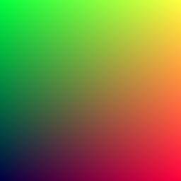

# Ray Tracing in One Weekend

## Output an Image
creating the first image

```bash
cargo r --example=first_image 
```


**first image**


**expected image**


## Rays, a Simple Camera, and Background


```bash
cargo r --example=first_ray
```


**first ray**


**expected image: blue to white**
