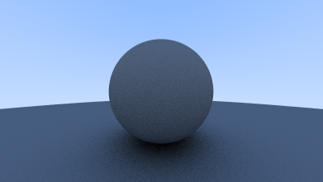

# Ray Tracing in One Weekend

## Output an Image

```bash
cargo r --release --example=first_image 
```

First image                     |  expected
:-------------------------:|:----------------------------------:
 |  

## Rays, a Simple Camera, and Background

blue to white

```bash
cargo r --release --example=first_ray
```

blue to white                  |  expected
:-------------------------:|:---------:
 |  

## Adding a Sphere

```bash
cargo r --release --example=red_sphere
```

Red Sphere                    |  expected
:-------------------------:|:---------:
 |  

## Surface Normals and Multiple Objects

```bash
cargo r --release --example=normals_on_a_sphere
```

Surface Normals                     |  expected
:----------------------------------------------------------:|:---------------------------------------------------------------------------------------------------:
 |  

```bash
cargo r --release --example=normals_on_a_sphere_with_groud
```

Surface Normals With Ground                     |  expected
:-------------------------:|:---------:
 |  

## Antialiasing

```bash
cargo r --release --example=antialiasing
```

without antialiasing         |  with antialiasing
:-------------------------:|:---------:
 |  

## Diffuse Materials

```bash
cargo r --release --example=diffuse_materials
```

diffuse sphere         |  diffuse sphere with gamma correction
:-------------------------:|:---------:
 |  

Rendering the lambertian sphere

```bash
cargo r --release --example=lambertian_sphere
```

Rendering the diffuse sphere with hemispherical scattering

```bash
cargo r --release --example=diffuse_sphere_with_hemispherical_scattering 
```

|Lambertian sphere| diffuse sphere with hemispherical scattering|
:-------------------------:|:-------:|
 | 

## Metal

Rendering shiny metal

```bash
cargo r --release --example=shiny_metal
```

Rendering  fuzzed metal

```bash
cargo r --release --example=fuzzed_metal
```

|Shiny metal| fuzzed metal|
:-------------------------:|:-------:|
 | 
